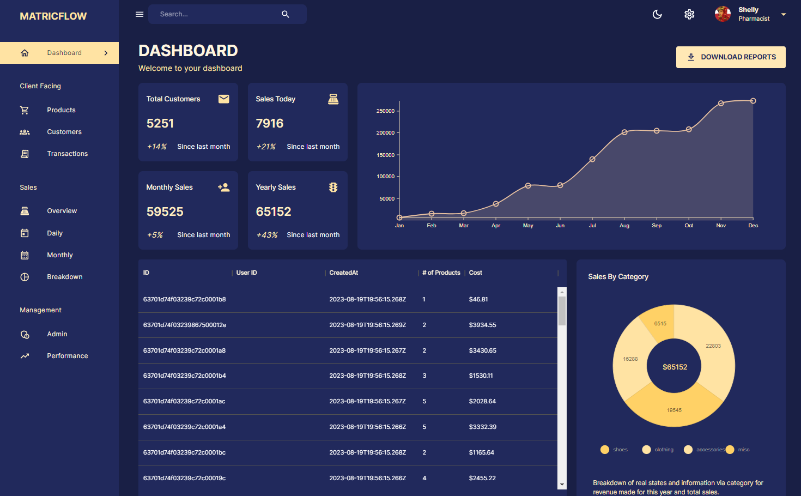
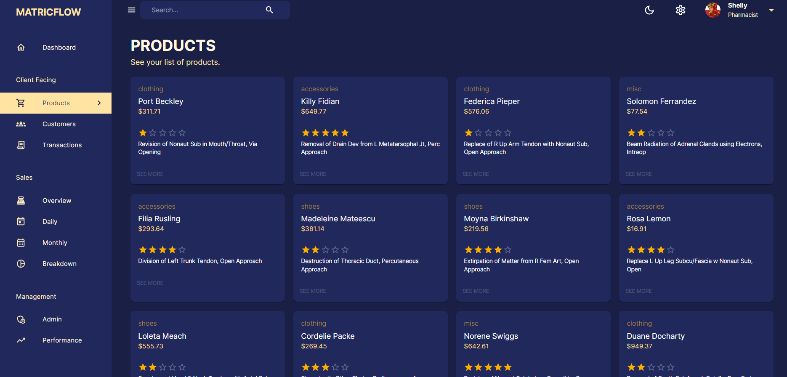
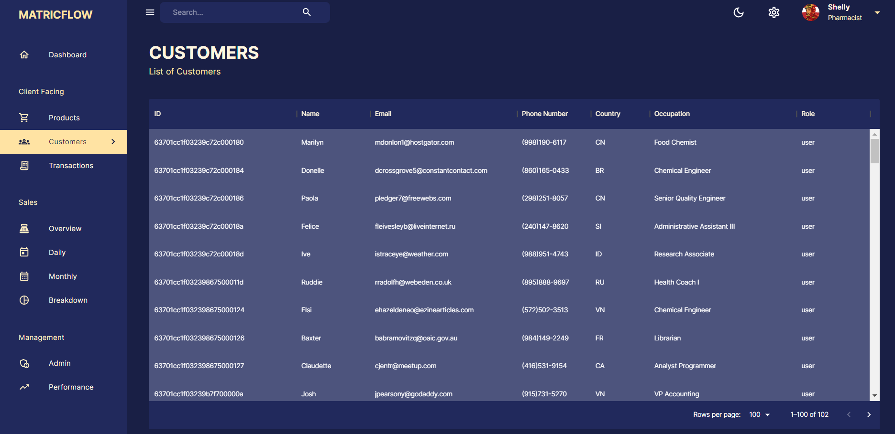

# MetricFlow-MERN

The project introduces a cutting-edge data management system featuring an advanced admin panel developed with ReactJS and MaterialUi for a sleek and user-friendly interface. Utilizing **NodeJS**, **ExpressJS**, and **MongoDB** for the backend ensures a robust foundation for real-time data processing. The MUI DataGrid facilitates organized tabular data representation, enhancing user interaction and analysis. **NivoCharts** integration provides versatile and visually compelling data visualizations, empowering users with valuable insights. This comprehensive solution leverages the strengths of **ReactJS**, **MaterialUi**, **NodeJS**, **ExpressJS**, and **MongoDB** to deliver an efficient and scalable platform for tracking and showcasing real-time data, making it an ideal tool for data analysis and decision-making.

#### 📌 Tech Stack utilised

| Utilised on              | Tech Stack Names                 |
| ------------------------ | -------------------------------- |
| **Frontend**             | ReactJS, CSS, Material UI_V5     |
| **Backend**              | NodeJS, ExpressJS, MongoDB, CORS |
| **Charts and Data-Grid** | MaterialUI-DataGrid, Nivo-Charts |

#### ⚡ Installation Guide

First clone the repository from the github

```
git clone https://github.com/arkajitroy/terminalState-Next.git
```

After that go to the specific directories `react_client` and `node_server`

And quickly install the node-mudules by `npm install` or `npm i --legacy-peer-deps`

After installation of all node mudules start the server.

```
npm run dev // For Frontend

npm run develop // For Backend
```

#### 📌 Snapshots of the Application

##### 1. Homescreen (Main Dashboard Section)



##### 2. Products Page (Product Listing Page)



##### 3. Customers Page (Data-grid view)


